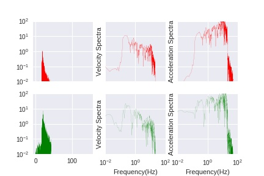
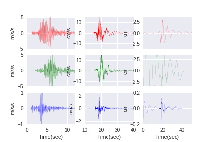

# EGFM-Python
Empirical Green's Function Method to synthesis strong ground motion complete in Python

# Emprical Green's Function Method
- [EGFM](http://www.kojiro-irikura.jp/research/research_e.html)

# EGFM by Python
- Why ? Easy to Modify and Visualize


# Codes
## egfm.py
- IO: readTH
- Data fromat transfer: zoo2th (CSMNC2TH, CSMNC2SAC)
- Vectorize to quickly run: calWeight
- Filter and FFT by numpy

## egfm_pc.py
1. Initialize variables;
2. Read parameters from input file;
3. Read time histories of main and after shocks;
4. Process time histories: input -> rmean-> integrate -> bandpass filter -> rmean -> output;
5. Calculate factor for propagation correction, function: calRdn;
6. Calculate weight for superpose in time domain and synthetize (calWeight, synt);
7. Rmean and visualize

## Example
One component in Miyake, 2003, BSSA
- Main Schock: 1997 March, Kagoshima-ken Hokuseibu $M_{JMA}$ 6.5  
- Station: K-NET, KGS002
- After Schock: 1997 March, Kagoshima-ken Hokuseibu $M_{JMA}$ 4.7
  
Table Parameters of main and after shocks  

-----
| Date(JST) |Latitude (deg)|Longitude (deg)|Depth (km)| $M_{JMA}$|
|--- |----|----|-----|------|
|1997/03/26 17:31 |31.970N|130.380E| 8.2 | 6.5 |
|1997/03/26 17:39 |31.968N |130.362E| 11.1 | 4.7 |

-----

<div class="naked-img">

</div>
  
Fig. Amplitude spectra of mainshock and synthetic ground motions
 
cd ./example
## Run follow script in Ipython
```python
from egfm import *
zoo2th('mainShock.zoo', 'mainTH.txt')
zoo2th('afterShock.zoo', 'egfTH.txt')
%run egfm_pc.py
```  
(enter input file name) 1997KKH.txt

    

  
<div class="naked-img">

</div>  
Fig. The timehistories of mainshock, aftershock and synthetic ground motions
